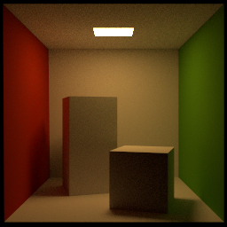

## learn_mitsuba2

### Install
* Configure `mitsuba.conf` file, e.g., by adding `gpu_autodiff_rgb`.
* Run VisualStudio on Release mode and then run Build->Build Solution.
* Run setpath.bat if you are using Windows 10.

### Render a scene
